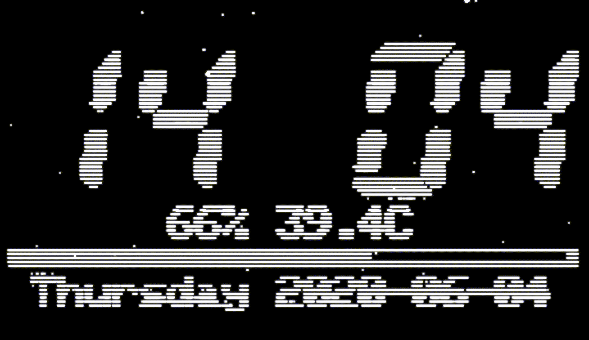
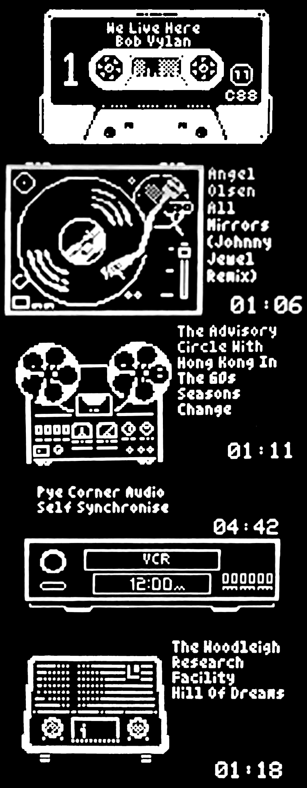
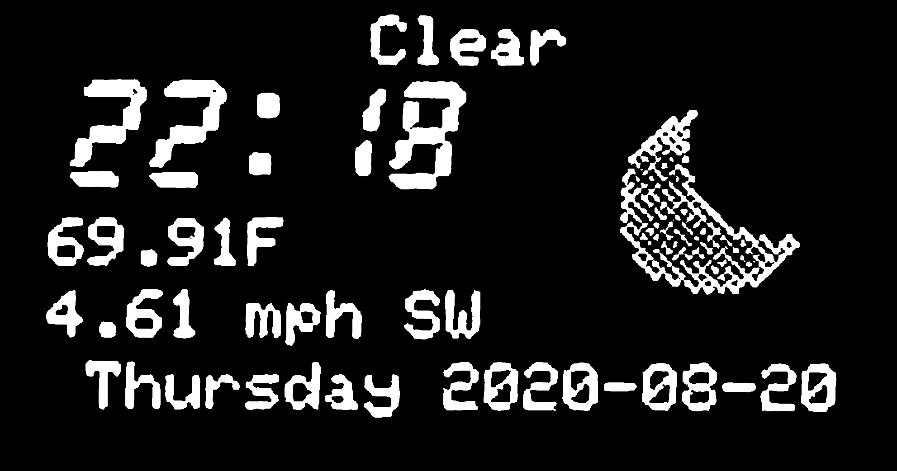

# LMSMonitor
OLED information display control program for [piCorePlayer](https://www.picoreplayer.org/) or other Raspberry Pi and Logitech Media Player (LMS) based audio device.


### Features
- Removed static library usage, smaller size, upgrade hardened
- Removed use of ALSA MIMO, audio attributes provided by LMS are used
- Track details are displayed only when playing
- Display features independant scrolling of track details.
- Remaining time can now be displayed rather than total time
- Audio attributes, volume, sample depth, and sample rate are shown
- A retro clock is displayed when the audio paused/stopped.
- Automatically sets the brightness of the display at dawn and dusk.
- Multiple audio visualization modes are supported

### Options
```bash
Usage: lmsmonitor --name "NAME" [OPTIONS...]
OLED information display control program for piCorePlayer or other Raspberry Pi
and LMS based audio device.

  -a, --allinone               One screen to rule them all. Track details and
                               visualizer on single screen (pi only)
  -b, --brightness             Automatically set brightness of display at sunset
                               and sunrise (connected to internet, pi only)
  -B, --bus[=BUSNUM]           I2C bus number (defaults 1, giving device
                               /dev/i2c-1)
  -c, --clock[=MODE]           Display clock when not playing, specify 12 or 24
                               (default) hour format (Pi only)
  -C, --spi_cs=SPI_CS          SPI CS number (defaults 0)
  -d, --downmix                Downmix (visualization) audio and display a single
                               large meter, SA and VU only
  -D, --spi_dc=SPI_DC          SPI DC GPIO number (defaults 24)
  -E, --egg=EGGNUM             Easter Eggs (see repo for details)
  -f, --font=FONT              Font used by clock, see list below for details
  -F, -I, --flip, --invert     Invert the display - if display mounted upside
                               down
  -k, --metrics                Show CPU load and temperature (clock mode)
  -K, --spi_speed=SPI_SPEED    SPI transmission speed (default 15k)
  -l, -i, --log-level=LEVEL, --info=LEVEL
                               Log Level
  -m, --meter=MODES            Meter modes, if visualization on specify one or
                               more meter modes, sa, vu, pk, st, or rn for
                               random
  -n, --name=PLAYERNAME        Name of the squeeze device to monitor
  -o, --oled[=OLEDTYPE]        Specify OLED "driver" type (see options below)
  -q, -s, --quiet, --silent    Don't produce any output
  -r, --remain-time            Display remaining time rather than track time
  -R, --reset=SPI_RST          I2C/SPI reset GPIO number, if needed (defaults
                               25)
  -S, --scroll[=SCROLLMODE]    Label scroll mode: 0 (cylon), 1 (infinity left), 2
                               infinity (right)
  -v, --visualize              Enable visualization sequence when track playing
                               (pi only)
  -V, --verbose                Maximum log level
  -w, --weather[=APIKEY,UNITS] Climacell API key and required units (optional)
  -x, --addr                   OLED address if default does not work - use
                               i2cdetect to find address (pi only)
  -z, --nosplash               No (Team Badger) Splash Screen
  -?, --help                   Give this help list
      --usage                  Give a short usage message
      --version                Print program version

Supported OLED types:
    1 ...: Adafruit SPI 128x64
    3 ...: Adafruit I2C 128x64
    4 ...: Seeed I2C 128x64
    6* ..: SH1106 I2C 128x64
    7 ...: SH1106 SPI 128x64

* is default

OLED Clock Fonts:
    0 ...: Classic LCD Clock Font
    1 ...: Deco-Solid Font
    2 ...: Deco-Hollow Font
    3 ...: LCD 25x44
    4 ...: Festus Hollow 25x44
    5 ...: Festus Solid 25x44
    6 ...: Space 1999
    7 ...: Roboto Thin
    8 ...: noto 25x44
    9 ...: noto fancy 25x44
   10 ...: Colby Typo 25x44
   11 ...: TTY Pongo 25x44
   12 ...: Windswept 3D 25x44

```

### Screen-snaps
The following images were captured by dumping the display on refresh; it's a tad blocky but the actual screen animations are buttery smooth.

See the videos in the base folder, scrolling text is smooth and the visualizer modes very kinetic.


These font examples were captured using an OLED on a flatbed scanner, the final images being tweaked for contrast.
Font examples are 0, at 14:04, through 12, at 13:10. The fonts are in the sequence described in the usage output.



### Visualizer Modes

Several visualizer modes are supported
- Stereo VU Meters - dBfs metered
- Stereo 12-band Spectrum Analysis
- Stereo 12-band "tornado" Spectrum Analysis
- Stereo 12-band "mirror" Spectrum Analysis
- Stereo Peak Meter - dBfs metered
- Large Downmix (visual data only) VU meter
- Large Downmix (visual data only) Spectrum
- All-In-One - track details and spectrum/VU "swoosh"
- All-In-One - fixed mode (use -aa)
- Easter Eggs - fixed mode (use -E[1-5])

### Installation

There are two modes of operation (3 if you include the text only mode)

- LMSMonitor installed on piCore Player, consuming visualization data directly
- LMSMonitor installed on an alternate device, the LMS Server for example, consuming streamed visualization data

# Prerequisites

If you are intending to consume visualization data you need to configure squeezelite to expose the shared memory

From the Squeezlite page of the pCP web frontend type 1 in the "m" ALSA parameter section

And, in the Various Options add *-v*

See the squeezelite page for more details

We also need to install the i2c tools library so we can review setup and communicate with the OLED screen

From the main web form click on Extensions button in the *Additional functions* section

On the page displayed select *i2c-tools-dev.tcz* from the dropdown and install

## pCP Install

SSH to your pCP device.

cd to the /mnt/mmcblk0p2/tce folder

and, then type:

```bash
wget "https://github.com/shunte88/LMSMonitor/blob/master/bin/lmsmonitorpcp.tgz?raw=true" -O lmsmonitorpcp.tgz && \
tar -xzvf lmsmonitorpcp.tgz && \
chmod +xX gomonitor
```

This downloads the monitor archive to pCP and extracts the contents and set execution permissions

With that you can manually start the monitor specifying the visualization you'd like to display, vu, sa, pk, st, sm or rn

For example:

```bash
./gomonitor rn
```

You should see the monitor logo screen appear.  You're pretty much done

## Automated start-up

If you'd like the monitor to automatically start with your pCP and squeezelite setup goto the *Tweaks* page of the pCP web forms.

Add a *User command*, here for example requesting the random visualizations

```bash
/mnt/mmcblk0p2/tce/gomonitor rn
```

Additional supported commands may also be specified, here we request a specific visualizer sequence, the device driver, override the default OLED address, request downmixed visualizers, and automated display brightness at dawn and dusk

```bash
/mnt/mmcblk0p2/tce/gomonitor vu,sa,pk,st -o6 -x 0x3c -db
```

the visualization parameter must always be specified first

## Easter Eggs
<p>


There are several "easter egg" modes provided for those setups that cannot process the audio data for visualization.
That said theres nothing stopping you using them as your main visualization.

There are currently 5 easter egg modes
- 1 Compact Cassette, as visually correct as possible given the OLED limitations.  Hubs turn and the tape window shows the track "progress"
- 2 Technics SL-1200, as visually correct as possible given the OLED limitations.  Tone arm traverses platter to indicate progress.
- 3 Open Reel To Reel, pure fantasy. Reels rotate, minor animation.
- 4 VCR with flashing 12:00 AM clock! No additional animation - the clock is annoying enough.
- 5 An old bakelite radio. Minor animation, radio changes station as track progresses.

Specify -E[1-5] to display eggs on track playback
</p>
These are just fun display mode where visualization is not possible

## Weather
<p>


Weather may be displayed when there is no track playing.

To use weather you'll need a climacell account.

Follow the instructions here [developer.climacell.co](https://developer.climacell.co/sign-up) to sign up for the service

This is a free developer account that facilitates upto 100 requests per hour.

LMSmonitor is metered to only make 10 calls per hour.

Once you have an key you'll simply pass it to LMSMonitor, thus

```bash
/mnt/mmcblk0p2/tce/gomonitor rn --weather "apikey[,units]"
```
Use the weather argument to pass the key and optionally the units you prefer.  By default units will be <b>us</b>

As with the brightness control the monitor will automatically determin your location via your ISP; ifyou find this gives inaccurate current weather conditions you can specify your latitude and longitude via thecommand line.

```bash
/mnt/mmcblk0p2/tce/gomonitor rn --latlon "latitude,longitude"
```

You can find yourlatitude and longitude via Google maps or alternatively via [latlon.net](https://www.latlong.net/)

Hopefully climacell won't see this as a commercial app and allow LMSmonitor usage.

</p>

### Audiophonics RASPI MINI

The Audiophonics RASPI MINI uses an SPI OLED
To get it working you need only specify the configuration as follows

```bash
/mnt/mmcblk0p2/tce/gomonitor rn -db -o7 -D27 -R24 -C0 -I 
```

This specified the SPI driver (7), DC pin 27, Reset pin 24 with the device on CE0.

The device is mounted upside down in the case, -I flips the display

This also specifies random visualization, further customization to your liking can be specified

### Coming soon

- DONE! Audio visualizer support: stereo VU meters
- DONE! Audio visualizer support: spectrum analyzer
- DONE! Audio visualizer support: tornado spectrum analyzer
- DONE! Audio visualizer support: mirror spectrum analyzer
- DONE! Audio visualizer support: horizontal Peak RMS
- DONE! Audio visualizer support: random and multiple meters
- DONE! Set display brightness, day and night modes.
- DONE! Downmix visual data and display on one large VU meter.
- DONE! Downmix visual data and display on one large Spectrum.
- DONE! Make OLED driver user selectable
- DONE! Make OLED I2C address user selectable
- DONE! All-In-One display, clock, track details and downmix visualizer in one 
- Reconnect to player, after reboot or offlined
- DONE! Weather: climacell incorporation
- Audiophonics EVO-SABRE Balanced DAC 2x ES9038Q2M support: TBD
- Dual OLED visualizer mode: TBD
- 128 x 128 OLED support: TBD
- Color 128 x 128 color TFT support: TBD

## Like The App - Git The Shirt

Team Badger shirts are here [shunte88](https://www.zazzle.com/team_badger_t_shirt-235604841593837420)

## Credits

OLED interface based on ArduiPI_OLED: <https://github.com/hallard/ArduiPi_OLED>
(which is based on the Adafruit_SSD1306, Adafruit_GFX, and bcm2835 libraries).

C library for Broadcom BCM 2835: <https://www.airspayce.com/mikem/bcm2835/>
