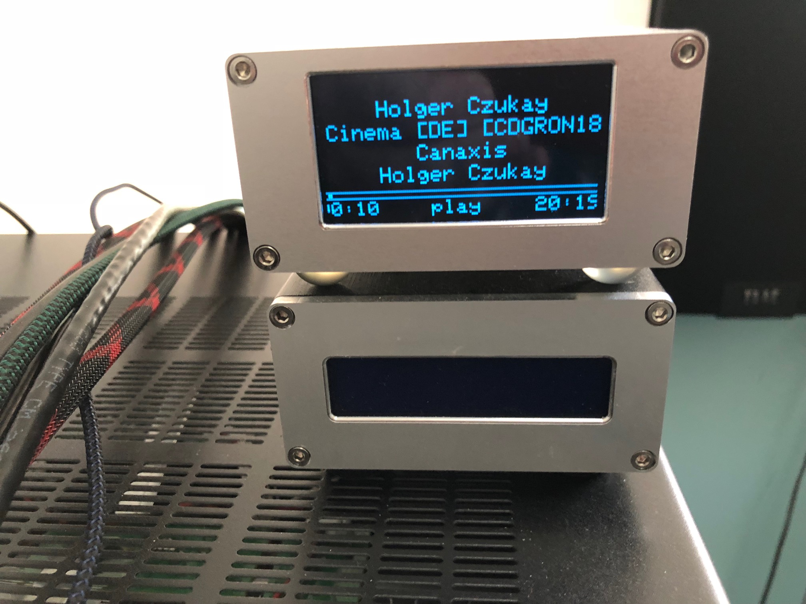

# LMSMonitor
OLED information display control program for [piCorePlayer](https://www.picoreplayer.org/) or other Raspberry Pi and Logitech Media Player (LMS) based audio device.



### Options
```bash
-n Player Name
-c display clock when not playing
-t enable print info to stdout
-l increment verbose level
-v activate visualization
-m VU meters and spectrum analysis
-r display remaining time rather than track time
```

### Features
- Removed static library usage, smaller size, upgrade hardened
- Removed use of ALSA MIMO, audio attributes provided by LMS used
- Track details are displayed only when playing
- Display features independant scrolling of track details.
- Remaining time can now be displayed
- Audio attributes, volume, sample depth, and sample rate are displayed
- A retro clock is displayed when audio paused/stopped.

### Screen-snaps
The following images were captured by dumping the display on refresh; it's a tad blocky but the actual screen animations are buttery smooth with a 15 FPS attained.

At 15 FPS scrolling text is smooth and the visualizer modes very kinetic.


### Visualizer Modes

Currently two visualizer modes are supported
- Stereo VU Meters - dBfs metered
- Stereo 12-band Spectrum Analysis
- Stereo Peak Meter - dBfs metered

### Installation

There are two modes of operation (3 if you include the text only mode)

- LMSMonitor installed on piCore Player, consuming visualization data directly
- LMSMonitor installed on an alternate device, the LMS Server for example, consuming streamed visualization data

# Prerequisites

If you are intending to consume visualization data you need to configure squeezelite to expose the shared memory

From the Squeezlite page of the pCP web frontend type 1 in the "m" ALSA parameter section

And, in the Various Options add *-v*

See the squeezelite page for more details

We also need to install the WiringPi library so we can communicate wit the OLED screen

From the main web form click on Extensions button in the *Additional functions* section

On the page displayed select *wiringpi.tcz* from the dropdown and install

## pCP Install

SSH to your pCP device.

cd to the /mnt/mmcblk0p2/tce folder

and, then type:

```bash
wget "https://github.com/shunte88/LMSMonitor/blob/master/bin/lmsmonitorpcp.tgz?raw=true" -O lmsmonitorpcp.tgz && tar -xzvf lmsmonitorpcp.tgz
```

This downloads the monitor archive to pCP and extracts the contents

To ensure smooth running perform the following:

```bash
chmod +x gomonitor
```

With that you can manually start the monitor specifying the visualization you'd like to display, vu, sa or pk

For example:

```bash
./gomonitor sa
```

You should see the monitor logo screen appear.  You're pretty much done

## Automated start-up

I you'd like the monitor to automatically start with your pCP and squeezelite setup goto the *Tweaks* page of the pCP web forms.

Add a *User command*, here for example requesting the Spectrum Analysis visualization

```bash
/mnt/mmcblk0p2/tce/gomonitor sa
```

### Coming soon
- DONE! Audio visualizer support: stereo VU meters
- DONE! Audio visualizer support: spectrum analyzer
- DONE! Audio visualizer support: horizontal Peak RMS
- Weather: TBD
- Dual OLED visualizer mode: TBD
- Color 128 x 128 color TFT support